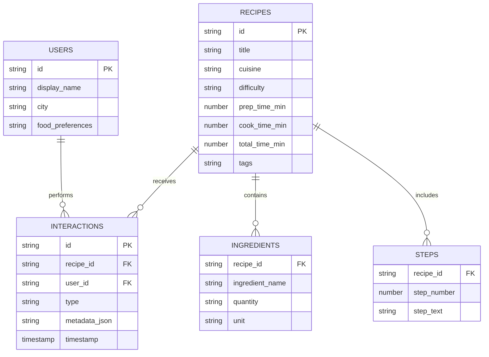
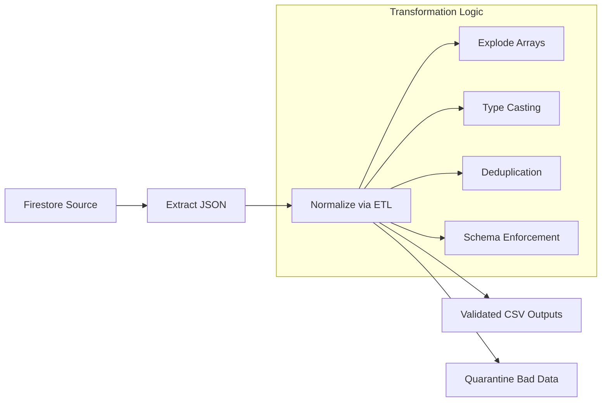

# Firebase Recipe Analytics Pipeline


---

## 1. Project Overview

This project implements a fully automated, end-to-end **Data Engineering Pipeline** that extracts recipe, user, and interaction data from **Google Firestore**, cleans & normalizes it, enforces data-quality rules, and generates analytical insights and visualizations.

The pipeline is built to simulate a production‑grade data engineering environment involving:
- NoSQL → Relational transformations  
- Data quality validation  
- Error quarantining  
- Orchestration via a single command  
- Complete analytics generation  

**Seed Data:** The project includes a **custom real recipe** created by the user as the mandatory primary dataset.

---

## 2. Data Model Architecture

The system follows a clear relational schema built from Firestore’s nested documents.

### **Entity Relationship Diagram (ERD)**



---

## 3. Firebase Setup & Data Seeding

### **Firestore Configuration**
The system connects using a service account key:

```
serviceAccountKey.json
```

### **Collections Used**
- `recipes`
- `users`
- `interactions`

### **Synthetic Data Generation**
A Python-based Seeder generates:

- 1 authentic custom recipe (primary)
- 20 synthetic recipes
- 10 realistic user personas
- 300–400 weighted interactions  
  (views, likes, ratings, attempts)

All synthetic records follow realistic probabilities and metadata behavior.

---

## 4. ETL Pipeline Process

### **Pipeline Architecture Diagram**



### **Extraction**
The `export.py` module exports entire collections into:

```
export/
├── recipes.json
├── users.json
└── interactions.json
```

### **Transformation**
The ETL performs:
- JSON normalization
- Exploding ingredients & steps arrays
- Detecting duplicates
- Ensuring strict schema types
- Rejecting malformed records
- Writing only validated rows to:

```
output/etl/
├── recipe.csv
├── ingredients.csv
├── steps.csv
└── interactions.csv
```

### **Data Quarantine System**
All rejected rows are stored safely:

```
output/bad_data/
├── bad_recipes.json
├── bad_ingredients.csv
├── bad_steps.csv
├── bad_interactions.csv
└── duplicate_recipes.csv
```

---

## 5. Data Quality & Validation

### **Validation Rules Implemented**

| Category         | Rule Description | Action |
|------------------|------------------|--------|
| Completeness      | Required fields must exist | Reject |
| Non‑negative Time | prep/cook/total time ≥ 0 | Warn/Reject |
| Difficulty Domain | Must be: Easy/Medium/Hard | Quarantine |
| Referential       | Interactions must reference valid Recipe IDs | Orphan File |
| Structure         | Steps and Ingredients cannot be empty | Reject |
| Duplicate IDs     | Repeated Recipe IDs | Quarantine |

### **Validation Reports Generated**

```
output/validation/
├── validation_report.md
└── validation_results.json
```

`validation_results.json` includes:
- Severity levels (High/Medium/Low)
- Color indicators
- Percentages
- Total issue count
- Breakdown per rule

---

## 6. Analytics & Insights

The analytics engine automatically produces ~10 insights including:

- Most common ingredients
- Recipe difficulty distribution
- Prep-time vs rating correlation
- Engagement leaders (top 10 recipes)
- Ingredients associated with high engagement
- Time complexity / ROI scoring
- Heatmap correlations
- Word cloud of ingredients

Charts are saved in:

```
output/analytics/charts/
```

A full summary is written to:

```
output/analytics/analytics_summary.md
```

---

## 7. Setup & Execution Instructions

### **Prerequisites**
- Python 3.9+
- Firebase Admin SDK credentials
- Installed dependencies:

```
pip install -r requirements.txt
```

### **Steps to Run Pipeline**

#### **1. Place Firebase Key**
```
serviceAccountKey.json in project root
```

#### **2. Run Full Pipeline**
```
python pipeline.py
```

This automatically runs:
```
Export → ETL → Validation → Analytics
```

#### **3. Check Outputs**
Everything appears in:

```
output/
    ├── etl/
    ├── validation/
    ├── analytics/
    └── bad_data/
```

---

## 8. Known Constraints

- Synthetic recipes may not represent real-world cooking accuracy.
- Pipeline is optimized for local execution (Pandas).  
  For big data scale, migration to Spark / Dataflow is recommended.
- Firestore export is non‑incremental (full dump each run).

---

## 9. Directory Structure

```
project/
├── pipeline.py
├── export/
├── output/
│   ├── etl/
│   ├── analytics/
│   ├── validation/
│   └── bad_data/
├── serviceAccountKey.json
├── requirements.txt
└── README.md
```

---

## 10. Final Notes

This project demonstrates a complete production‑style data engineering system:
- Firestore → ETL → Validation → Analytics  
- Automated orchestration  
- Strong data‑quality safeguards  
- Business‑driven insights

