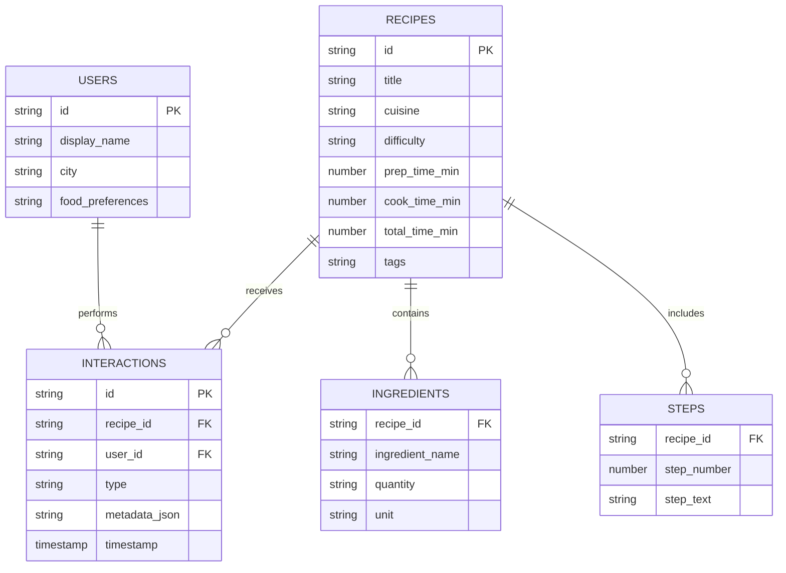
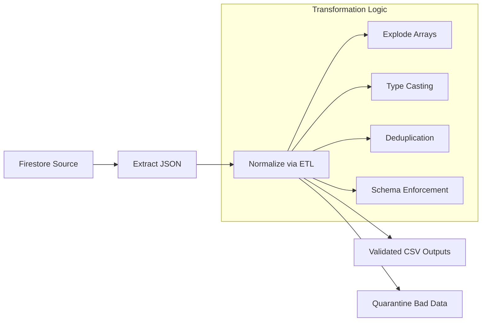

# Firebase Recipe Analytics Pipeline


---

## 1. Project Overview

This project implements a fully automated, end-to-end **Data Engineering Pipeline** that extracts recipe, user, and interaction data from **Google Firestore**, cleans and normalizes it, validates data quality, and generates analytics-ready insights and visualizations.

The pipeline simulates a real-world production data system with:

- NoSQL → relational normalization  
- Data quality validation and quarantining  
- Automated orchestration via a single command  
- Insight generation with visual analytics  

**Seed Data:** Includes one custom, real recipe (user-provided) as the foundational dataset, along with synthetic supporting data.

---

## 2. Expanded Data Model Architecture

Firestore stores semi-structured JSON documents. During ETL, this data is normalized into a clean relational model.

### 🔹 Recipe Model

Each recipe contains:

- Unique ID  
- Title & description  
- Cuisine & difficulty  
- Prep/Cook/Total times  
- Ingredients (array of objects)  
- Steps (array of strings)  
- Metadata: created_by, timestamps  

Ingredients example:

```json
{
  "name": "Onion",
  "quantity": 2,
  "unit": "pcs"
}
```

Steps stored as an ordered list.

---

### 🔹 Users Model

User documents store:

- user_id  
- display name  
- age  
- food preferences  
- account creation timestamp  

---

### 🔹 Interactions Model

Captures user engagement:

- interaction_id  
- user_id  
- recipe_id  
- type: view / like / rating / attempt  
- rating (optional)  
- timestamp  

---

## Entity Relationship Diagram (ERD)



---

## 3. Firebase Setup & Data Seeding

### Firestore Collections

- `recipes`
- `users`
- `interactions`

### Seeder Script Generates:

- 1 real recipe  
- 20 synthetic recipes  
- 10 synthetic users  
- 300–400 interactions  

This creates a realistic dataset for analytics.

---

## 4. ETL Pipeline Overview

### Pipeline Diagram



### Extraction

Firestore → JSON:

```
export/
├── recipes.json
├── users.json
└── interactions.json
```

### Transformation

ETL normalizes documents into:

```
output/etl/
├── recipe.csv
├── ingredients.csv
├── steps.csv
└── interactions.csv
```

### Quarantine System

Invalid records stored at:

```
output/bad_data/
```

---

## 5. Data Quality & Validation

Validation rules include:

| Rule Type | Description |
|----------|-------------|
| Completeness | Required fields must exist |
| Numeric Validity | Times must be ≥ 0 |
| Difficulty Domain | Only Easy / Medium / Hard |
| Referential Integrity | Valid recipe_id references |
| Structural Integrity | Steps & ingredients must be non-empty |
| Duplicate Detection | Duplicate IDs are quarantined |

Outputs:

```
output/validation/
├── validation_report.md
└── validation_results.json
```

---

## 6. Analytics & Insights

Analytics includes:

- Most common ingredients  
- Difficulty distribution  
- Prep-time vs rating correlation  
- Top engagement recipes  
- Heatmap correlations  
- Word cloud of ingredients  

Outputs:

```
output/analytics/charts/
output/analytics/analytics_summary.md
```

---

## 7. Orchestration System

The entire workflow is automated using a single orchestrator:

```
python pipeline.py
```

Pipeline stages triggered:

1. Export Firestore  
2. ETL normalization  
3. Validation  
4. Analytics  

A complete manifest is stored:

```
output/logs/
```

This ensures reproducibility and traceability—similar to real-world Airflow or Prefect workflows, but implemented in pure Python.

---

## 8. Setup & Execution Instructions

### Install Requirements

```
pip install -r requirements.txt
```

### Add Firebase Credentials

Place Firestore key:

```
serviceAccountKey.json
```

### Run Entire Pipeline

```
python pipeline.py
```

### View Outputs

```
output/
    ├── etl/
    ├── validation/
    ├── analytics/
    └── bad_data/
```

---

## 9. Directory Structure

```
project/
├── pipeline.py
├── export/
├── output/
│   ├── etl/
│   ├── analytics/
│   ├── validation/
│   └── bad_data/
├── serviceAccountKey.json
├── requirements.txt
└── README.md
```

---

## 10. Known Limitations

- Synthetic recipe data may not reflect real-world distributions.
- Pandas-based ETL is optimized for local scale.
- Firestore export is full-dump (not incremental).
- Orchestration is Python-based, not Airflow/Prefect.

---

## Final Statement

This project demonstrates a strong production-style data engineering workflow with:

- Automated orchestration  
- Reliable validation  
- Scalable transformation  
- Insightful analytics  

A complete end-to-end Firestore → ETL → Validation → Analytics pipeline.

