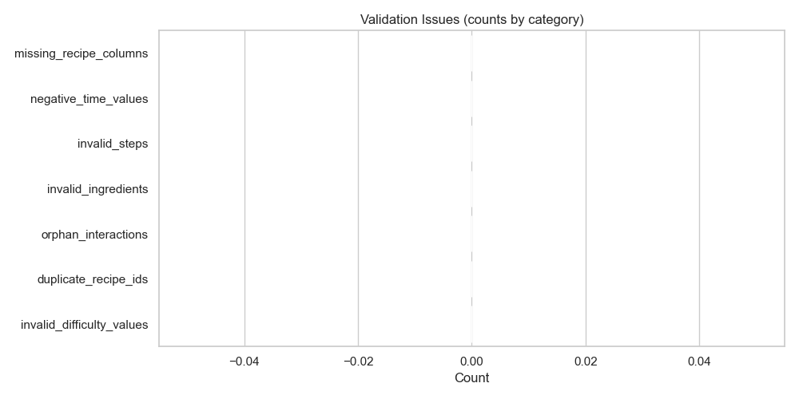

# Analytics Summary

Generated by analytics.py

## Executive Summary

This report computes engagement, ROI, complexity and other derived metrics to surface content strategy recommendations.

## 🛡 Data Quality Summary

- **Overall Data Quality Score:** **100.00%**

- **Total recipes checked:** 21

- **Total issues detected:** 0

### Issues by Category

- 🟢 **missing_recipe_columns** — 0 (0.00% of recipes) — Severity: Low
- ⚠️ **negative_time_values** — 0 (0.00% of recipes) — Severity: High
- 🟢 **invalid_steps** — 0 (0.00% of recipes) — Severity: Low
- 🟢 **invalid_ingredients** — 0 (0.00% of recipes) — Severity: Low
- 🟢 **orphan_interactions** — 0 (0.00% of recipes) — Severity: Low
- 🟢 **duplicate_recipe_ids** — 0 (0.00% of recipes) — Severity: Low
- 🟢 **invalid_difficulty_values** — 0 (0.00% of recipes) — Severity: Low

## Key Insights

### Insight 1: Most common ingredients

See the Top Ingredients chart for the most-used pantry items.

### Insight 2: Difficulty distribution

Distribution by difficulty provides insight into audience preference.

### Insight 3: Prep time vs rating

Scatter plot inspects whether longer prep correlates with higher ratings.

## Recommendations

- Promote quick-win (low complexity, high ROI) recipes.

- Augment metadata for recipes missing 'occasion' or 'nutrition_groups'.

- Prioritize social promotion for high-engagement recipes.

## Quick Statistics

- Total recipes analyzed: **21**
- Total interactions analyzed: **898**
- Average engagement rate: **30.87%**
